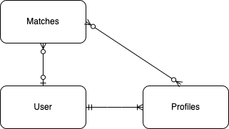

# Project 4 - Connect 4 

A clone of the classic game Connect 4. Using React to Create the application and ... (Come back to me...)

# User Stories (As a user I want to... )

- Be able to have clear instructions on how to play the game
    
- Have clear indications on who's turn it is

- Be able to only click on one space per round

- Know when I win

- Know when I lose

- Be able to start a new game

- Be able to see a scoreboard for playing multiple rounds in a match

- I want to make a match (MVP matches are best of 1 or best of 3)

- I want to see my old matches

- Be able to sign up 

- Be able to log in

- Be able to log out 

- Be able to change password

- Be able to create a profile

- Be able to select a profile

- Be able to create multiple profiles

- Be able to select multiple profiles 

- STRETCH - Be able to play agaisnt the computer

- STRETCH - Be able to play with other users (sockets)

# ERD 

# Models

- Profile Model
    - 1 to Many realationship with Users
    - Many to Many relationship with Matches
    - Profiles allow a user to keep track of players in matches this is especially helpful for "hot seat" style playing where two players are playing on the same machine. (OUR MVP)
Fields 
- name: String
- matches: refId
- owner: refId
- 

- Matches 
    - Many to 1 relationship with users
    - Many to Many relationship with Profiles
    - Matches allows a user to track the rounds you win or lose between profiles.
Fields 
- player1: refId - Profiles
- player2: refId - Profiles
- rounds: Number - Best of 1 or Best of 3 (ennum?)
- roundHistory: [String] - Where each index is the winner of that round
- isDone: Boolean 
- winner: String

# Route Table 

| Description | Verb | Url |
| ----- | ------ | ------ | 
| Sign up | POST | /signup |
| Sign in | POST | /signin |
| Sign out | DELETE | /signout |
| Change password | PATCH | /change-password |
| Profiles
 |  |  |
|  |  |  |