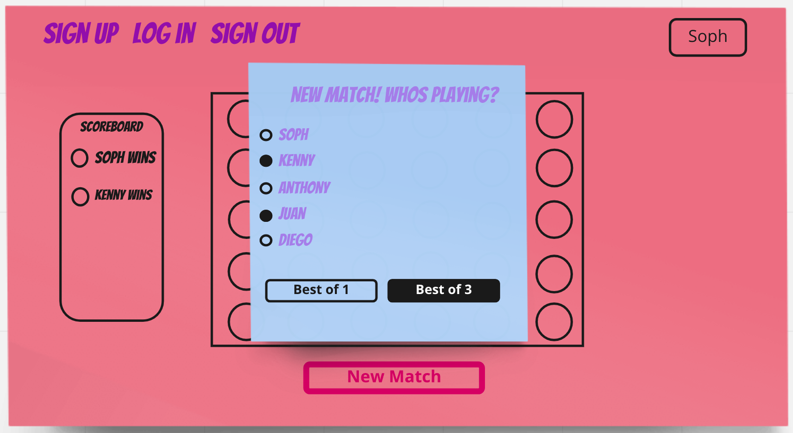

# Project 4 - Connect 4 

A clone of the classic game Connect 4. Using React to Create the application and ... (Come back to me...)

Used in conjunction with my [connect 4 API](https://github.com/Valkarie01/Connect-4-API)

# Tech Used - MERN Stack

Mongoose
Express
React
Node

# User Stories (As a user I want to... )

- Be able to have clear instructions on how to play the game
    
- Have clear indications on who's turn it is

- Be able to only click on one space per round

- Know when I win

- Know when I lose

- Be able to start a new game

- Be able to see a scoreboard for playing multiple rounds in a match

- I want to make a match (MVP matches are best of 1 or best of 3)

- I want to see my old matches

- Be able to sign up 

- Be able to log in

- Be able to log out 

- Be able to change password

- Be able to create a profile

- Be able to select a profile

- Be able to create multiple profiles

- Be able to select multiple profiles 

- STRETCH - Be able to play agaisnt the computer

- STRETCH - Be able to play with other users (sockets)

# Wire Frames

